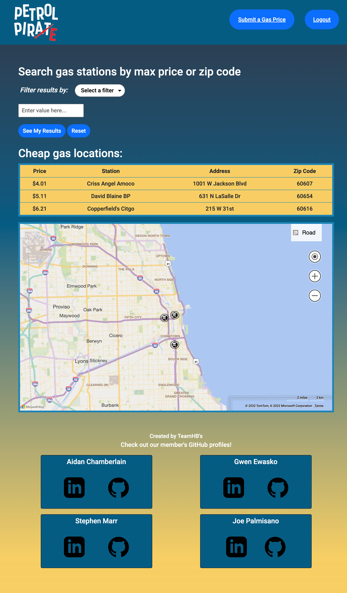

# Petrol Pirate 

## Table of Contents:

-   [Description](./README.md#description)
-   [License](./README.md#license)
-   [Contributing](./README.md#contributing)
-   [Screenshot](./README.md#screenshot)
-   [Links to Application](./README.md#links-to-application)
-   [Questions](./README.md#questions)

## Description

Petrol Pirate is an app where users may sign-in/sign-up and then view and submit low gas prices. When a user starts the application, they are presented a login page. Exisitng users can input their credentials and login; new users can input their information to add a new user to the database. When a user logs in, they are presented with the homepage showing the stations and prices along with a map showing a pin on each station. A user can choose a filter from a dropdown, input a value to filter on, and the table/map will then update to only show prices that pass the filter. A user can choose to submit a new price by clicking the button on the nav bar at the top of the page. On the submission page, a user is presented a form to fill out with the desired information. When a user submits the form and the address is not extant in the database, it will add the user's input to the database as a new price. If the user submits an address that already exists in the database, it will update that price in the database. After submission, a user is returned to the homepage with a notification of successfully adding/updating a price.

## License

This software is licensed to MIT, for more information you may visit this link:
[MIT License Wikipedia](https://en.wikipedia.org/wiki/MIT_License)

## Contributing

If you wish to contribute to our content, please contact one of us at:

asunshine99@gmail.com
gwenewasko@gmail.com
smarr2198@gmail.com
josephpalmisano18@gmail.com

## Screenshot

## Links to Application

-   Here is the repo: [https://github.com/TeamHBs/petrol-pirate](https://github.com/TeamHBs/petrol-pirate)
-   Here is the heroku: [https://hbs-project-two.herokuapp.com/](https://hbs-project-two.herokuapp.com/)
-   Here is the pages: [https://teamhbs.github.io/petrol-pirate/](https://teamhbs.github.io/petrol-pirate/)

## Questions

If you have any questions, you may contact:

#### Aidan Chamberlain

Email: asunshine99@gmail.com  
Github Profile: [https://www.github.com/RedComet6](https://www.github.com/RedComet6)

#### Gwen Ewasko

Email: gwenewasko@gmail.com  
Github Profile: [https://github.com/gwenewasko](https://github.com/gwenewasko)

#### Stephen Marr

Email: smarr2198@gmail.com
Github Profile: [https://www.github.com/smarr2198](https://www.github.com/smarr2198)

#### Joe Palmisano

Email: josephpalmisano18@gmail.com
Github Profile: [https://github.com/joepamedia](https://github.com/joepamedia)
